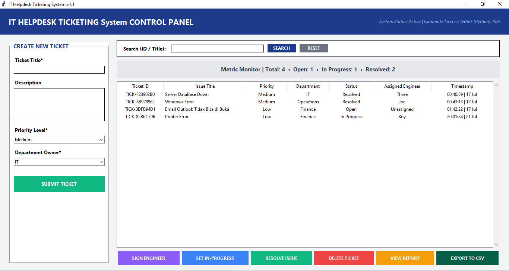
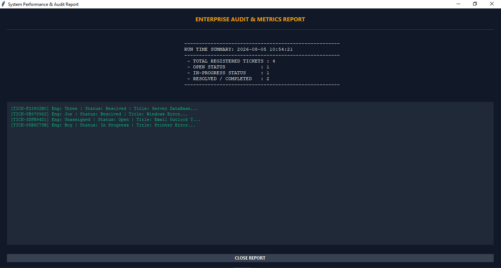

# IT Helpdesk Ticketing System

Aplikasi desktop untuk mengelola tiket IT Helpdesk secara terpusat — mulai dari pembuatan tiket, penugasan engineer, pelacakan status, hingga ekspor laporan. Dibangun sebagai final project bootcamp Python programming.

 

## 📋 Latar Belakang

Banyak tim IT internal masih mencatat tiket bantuan (server down, reset password, error software, dll) secara manual lewat chat atau spreadsheet, yang membuat status tiket sulit dilacak dan laporan sulit disusun. Aplikasi ini dibuat untuk menyederhanakan proses tersebut dalam satu control panel yang mudah digunakan, lengkap dengan penyimpanan data permanen ke file CSV.

## ✨ Fitur Utama

- **Create Ticket** — buat tiket baru dengan judul, deskripsi, priority level, dan department owner
- **Search & Filter** — cari tiket berdasarkan ID atau judul secara real-time
- **Metric Monitor** — ringkasan jumlah tiket (Total, Open, In Progress, Resolved)
- **Sign Engineer** — tetapkan engineer yang menangani tiket melalui dialog window
- **Update Status** — ubah status tiket (Open → In Progress → Resolved), otomatis mencatat waktu resolve
- **Delete Ticket** — hapus tiket dari database dengan konfirmasi
- **Export Report** — tampilkan laporan audit & metrik dalam window terpisah
- **Export to CSV** — ekspor seluruh data tiket ke file CSV pilihan lokasi sendiri (via file dialog)
- **Data Persistence** — data otomatis tersimpan dan dimuat ulang dari `tickets_db.csv`, jadi tidak hilang saat aplikasi ditutup

## 🖼️ Screenshot

### Dashboard Utama


### Report Window

## 🛠️ Tech Stack

- **Bahasa**: Python 3.x (dengan type hints)
- **GUI**: Tkinter + ttk
- **Penyimpanan Data**: Dictionary in-memory dengan persistence otomatis ke file CSV (`tickets_db.csv`)

## 🧩 Konsep Program yang Diterapkan

| Konsep | Implementasi |
|---|---|
| Object Oriented Programming | Class `Ticket`, `HelpdeskEngine`, `EnterpriseHelpdeskApp` |
| Encapsulation | Private attribute `__ticket_id`, `@property` |
| Type Hinting | Anotasi tipe pada parameter & return value (`str`, `Optional`, `Dict`, `List`) |
| Dictionary | `__database: Dict[str, Ticket]` sebagai penyimpanan utama |
| List | `get_all_tickets()` mengembalikan daftar tiket |
| CRUD | Create, Read, Update, Delete pada `HelpdeskEngine` |
| Event Driven Programming | Handler tombol dan event Tkinter (`command=...`) |
| GUI Programming | Tkinter + ttk (Treeview untuk tabel) |
| File Handling | Baca/tulis file CSV (`csv.DictReader`/`DictWriter`) |
| Exception Handling | `try-except` pada proses export & parsing tanggal |
| Looping | `for` untuk membaca, menampilkan, dan mengekspor data |
| Conditional | `if-else` untuk validasi input dan logika status |
| Persistence Data | Auto-save/load ke `tickets_db.csv` setiap ada perubahan data |
| MVC (sederhana) | Model (`Ticket`), Controller (`HelpdeskEngine`), View (`EnterpriseHelpdeskApp`) |

## 🏗️ Struktur Arsitektur

```
Model (Ticket)
   ↓
Controller (HelpdeskEngine) → CRUD, validasi, auto-save/load CSV
   ↓
View (EnterpriseHelpdeskApp / Tkinter GUI) → interaksi pengguna
```

## 🚀 Cara Menjalankan

```bash
# Clone repository
git clone https://github.com/username-kamu/it-helpdesk-ticketing-system.git
cd it-helpdesk-ticketing-system

# Jalankan aplikasi
python helpdesk.py
```

Saat pertama kali dijalankan, aplikasi akan otomatis membuat file `tickets_db.csv` untuk menyimpan data tiket.

## 📦 Requirements

```
Python 3.x
Tkinter (sudah termasuk dalam instalasi Python standar)
```

Tidak ada dependency eksternal — seluruhnya menggunakan library bawaan Python.

## 📌 Rencana Pengembangan Selanjutnya

- [ ] Versi web menggunakan Flask/FastAPI agar bisa diakses tanpa instalasi
- [ ] Migrasi penyimpanan dari CSV ke database relasional (SQLite/PostgreSQL)
- [ ] Role-based login (Admin vs Engineer)
- [ ] Notifikasi otomatis saat status tiket berubah

## Author

**Three Yulianto Ramdhani**
[LinkedIn](https://www.linkedin.com/in/three-ramdhani-558595106)

---
*Proyek ini dibuat sebagai final project dalam program bootcamp Python programming.*
cat >> README.md <<'EOF'

## Alur Kontribusi

Proyek ini dikelola dengan Git dan GitHub. Setiap perubahan dikerjakan di branch terpisah, lalu digabungkan ke `main` melalui Pull Request:

1. Buat branch fitur dari `main`, misalnya `feature/update-readme`.
2. Commit perubahan dengan pesan yang jelas.
3. Push branch ke GitHub, lalu buka Pull Request.
4. Setelah ditinjau, gabungkan (merge) ke `main`.
